# agentos-website

<p align="center">
  <picture>
    <source media="(prefers-reduced-motion: reduce)" srcset="assets/hero/hero-reduced.svg">
    <source media="(prefers-color-scheme: light)" srcset="assets/hero/hero-light.svg">
    
  </picture>
</p>

<p align="center">
  <picture>
    <source media="(prefers-reduced-motion: reduce)" srcset="assets/hero/computational-dark.svg">
    <source media="(prefers-color-scheme: light)" srcset="assets/hero/computational-light.svg">
    
  </picture>
</p>

Public site for [AgentOS](../agentos) — a local, provider-neutral agent
execution control plane.

This is not a chatbot landing page. The page *is* an inspect docket: two
sessions captured from AgentOS 0.5.0, replayed as the product actually
printed them.

## What is unusual about the product (and therefore the site)

AgentOS does not chat, wrap one model, or pretend adapter output is
success. It records four different facts:

```
REQUESTED ≠ ATTEMPTED ≠ EXECUTED ≠ VERIFIED
```

Default execution mode is `simulated`. `LIVE` needs explicit authority.
`result_state` for a simulated echo stays `PARTIAL`. Cost stays `UNKNOWN`
until a charge is measured. A destructive `rm -rf` is refused by policy
and the target is left intact.

The site language comes from that inspect surface — manila docket, stamped
states, event journal — not from generic AI/SaaS chrome.

## Captured sessions

Recorded 2026-09-25 in an isolated `$AGENTOS_HOME` against AgentOS 0.5.0:

- **echo** — `obj_fb47cae95169` completed; mode `simulated`;
  `result_state=PARTIAL`; `cost=UNKNOWN`; structural verify passed.
- **refuse** — `obj_d842b4ff4b84` blocked; three policy refusals of
  `rm -rf /tmp`; marker file still present.

Machine paths were rewritten to `$TMP` / `$AGENTOS_HOME`. The site does
not call a running engine.

## Commands

```bash
pnpm install
pnpm dev
pnpm test
pnpm lint
pnpm typecheck
pnpm build
pnpm preview
```

## Principles

- No invented claims. Numbers and states come from the captured CLI runs
  or from `src/product.json` (a snapshot of `agentos/product.json`).
- Supported and planned stay separate. Planned items are labelled planned.
- No analytics, cookies, or `curl | sh`.
- Websites never import AgentOS source. They describe it.

## Deploy

Static Vite. Vercel detects it. Set `VITE_SITE_URL` when a canonical
domain exists. There is no live URL until one is assigned.

<!-- TRILLIONX:presentation:begin -->

### Animated surfaces

Generated from this repository's own source tree: every count, route and module below was measured, not written by hand.

#### Identity

<picture>
  <source media="(prefers-reduced-motion: reduce)" srcset="https://raw.githubusercontent.com/M4G3LL4N0/agentos-website/main/.github-art/surfaces/hero-reduced.svg">
  <source media="(prefers-color-scheme: light)" srcset="https://raw.githubusercontent.com/M4G3LL4N0/agentos-website/main/.github-art/surfaces/hero-light.svg">
  
</picture>

#### Entry points

<picture>
  <source media="(prefers-reduced-motion: reduce)" srcset="https://raw.githubusercontent.com/M4G3LL4N0/agentos-website/main/.github-art/surfaces/terminal-reduced.svg">
  <source media="(prefers-color-scheme: light)" srcset="https://raw.githubusercontent.com/M4G3LL4N0/agentos-website/main/.github-art/surfaces/terminal-light.svg">
  
</picture>

#### Modules

<picture>
  <source media="(prefers-reduced-motion: reduce)" srcset="https://raw.githubusercontent.com/M4G3LL4N0/agentos-website/main/.github-art/surfaces/architecture-reduced.svg">
  <source media="(prefers-color-scheme: light)" srcset="https://raw.githubusercontent.com/M4G3LL4N0/agentos-website/main/.github-art/surfaces/architecture-light.svg">
  
</picture>

#### Primitives

<picture>
  <source media="(prefers-reduced-motion: reduce)" srcset="https://raw.githubusercontent.com/M4G3LL4N0/agentos-website/main/.github-art/surfaces/state_machine-reduced.svg">
  <source media="(prefers-color-scheme: light)" srcset="https://raw.githubusercontent.com/M4G3LL4N0/agentos-website/main/.github-art/surfaces/state_machine-light.svg">
  
</picture>

#### Build and tests

<picture>
  <source media="(prefers-reduced-motion: reduce)" srcset="https://raw.githubusercontent.com/M4G3LL4N0/agentos-website/main/.github-art/surfaces/build-reduced.svg">
  <source media="(prefers-color-scheme: light)" srcset="https://raw.githubusercontent.com/M4G3LL4N0/agentos-website/main/.github-art/surfaces/build-light.svg">
  
</picture>

#### Workflow

<picture>
  <source media="(prefers-reduced-motion: reduce)" srcset="https://raw.githubusercontent.com/M4G3LL4N0/agentos-website/main/.github-art/surfaces/workflow-reduced.svg">
  <source media="(prefers-color-scheme: light)" srcset="https://raw.githubusercontent.com/M4G3LL4N0/agentos-website/main/.github-art/surfaces/workflow-light.svg">
  
</picture>

#### Domain

<picture>
  <source media="(prefers-reduced-motion: reduce)" srcset="https://raw.githubusercontent.com/M4G3LL4N0/agentos-website/main/.github-art/surfaces/domain-reduced.svg">
  <source media="(prefers-color-scheme: light)" srcset="https://raw.githubusercontent.com/M4G3LL4N0/agentos-website/main/.github-art/surfaces/domain-light.svg">
  
</picture>

#### Identity object

<picture>
  <source media="(prefers-reduced-motion: reduce)" srcset="https://raw.githubusercontent.com/M4G3LL4N0/agentos-website/main/.github-art/surfaces/footer-reduced.svg">
  <source media="(prefers-color-scheme: light)" srcset="https://raw.githubusercontent.com/M4G3LL4N0/agentos-website/main/.github-art/surfaces/footer-light.svg">
  
</picture>

<!-- TRILLIONX:presentation:end -->

<!-- TRILLIONX:evidence:begin -->

## What is measurable here

Generated by `.github-art` from the source tree at publish time.

| Signal | Value |
| --- | --- |
| HTTP routes | 0 |
| Entry points | 1 |
| Module roots | 1 |
| Test files | 1 |
| CI workflows | 1 |
| Distinctive stack | scaffold only |
| Status | TESTED |
| Evidence confidence | E3 |
| Animated surfaces | 8 |

<!-- TRILLIONX:evidence:end -->
